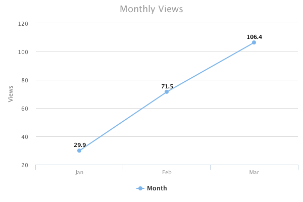

## Getting Started
```
git clone git@github.com:rmcvey/highchart-server.git
npm install
node server.js
```
## Usage
Server runs on port 3004, you are welcome to change this to whatever you'd like.  Charts are generated on the server and are served as png files directly from endpoint requests (though they can also be accessed as static files).

## Line & Area Charts

**Endpoint**:  `/chart/line`

**Querystring parameters**: 
```
data: comma-separated list of values
cols: comma-separated list of yAxis labels
title: chart title
xName: labels for x-axis
yName: label for y-axis
type <optional>: one of line, area or arealine, defaults to *line*
```
**Example**:
`/chart/line?data=29.9,71.5,106.4&cols=Jan,Feb,Mar&title=Monthly%20Views&xName=Month&yName=Views&type=line`



## Pie Charts
**Endpoint**: `/chart/pie`

**Querystring parameters**: 
```
data: comma-separated list of key-value pairs, separated by a colon
title: chart title
type <optional>: one of pie or donut (defaults to *pie*)
```
**Example:**
`/chart/pie?data=Male:29.9,Female:71.1&title=Demographics`


## HighCharts Licensing
This code is not endorsed or created by HighCharts. HighCharts licenses apply to your usage of this code. Currently, HighCharts is free for non-commercial use and they have a number of paid options for commercial use. Please visit their website for more information.

### more charts coming soon
