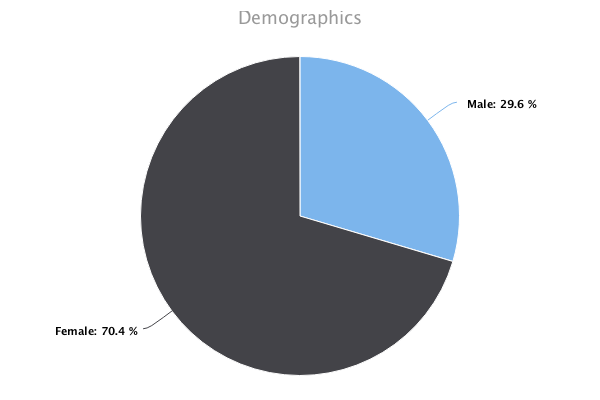

## Getting Started
This project is using ES6 classes, so you will need iojs with the --harmony_classes flag (for now)
```
git clone git@github.com:rmcvey/highchart-server.git
npm install
iojs --harmony_classes server.js
```

## Usage
Server runs on 3004, you are welcome to change this to whatever you'd like. Charts can be generated by navigating to:

### Line & Area Charts
The type parameter will change the chart type to line, area or arealine
`/chart/line?data=29.9,71.5,106.4&cols=Jan,Feb,Mar&title=Monthly%20Views&xName=Month&yName=Views&type=line`


### Pie Charts
`/chart/pie?data=Male:29.9,Female:71.1&title=Demographics`



## More charts coming soon